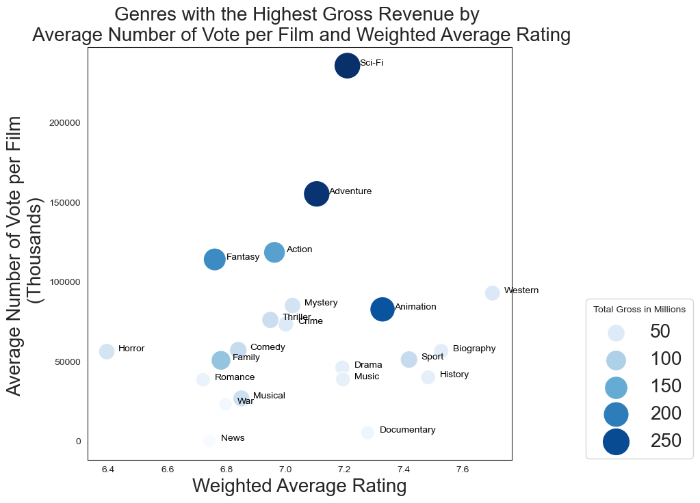
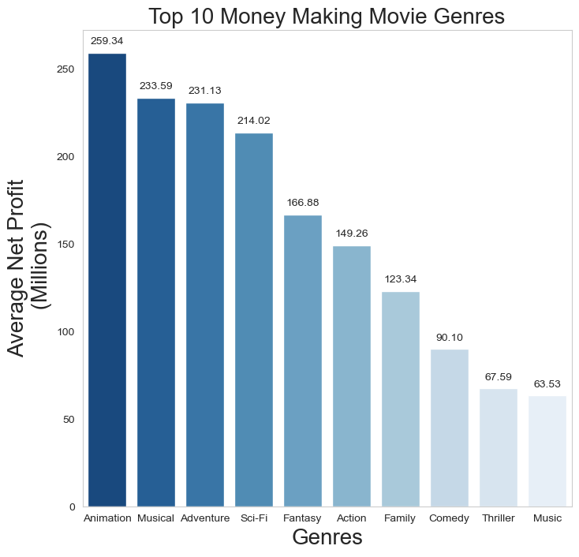
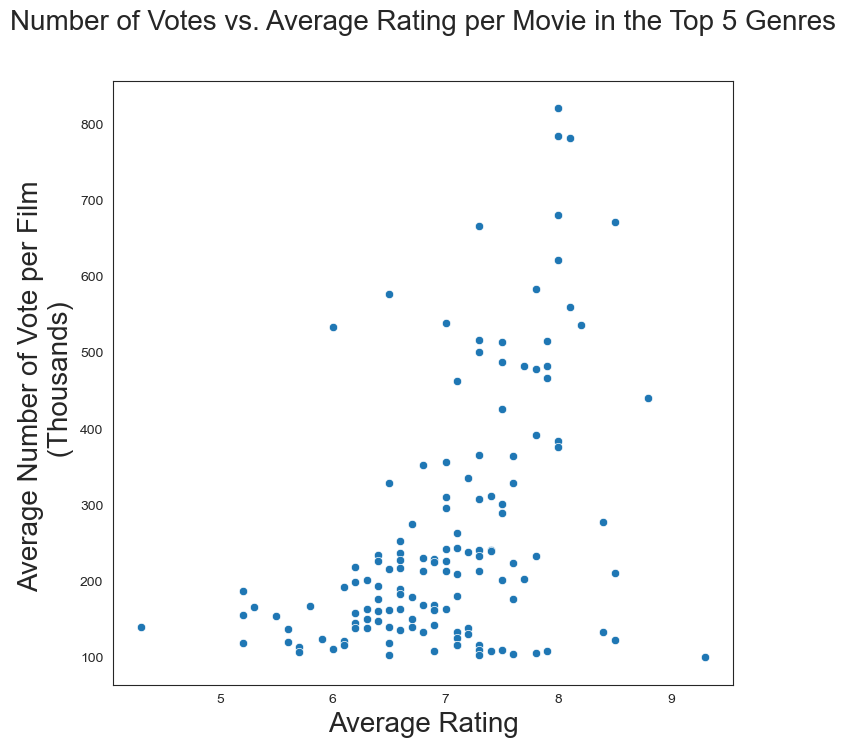
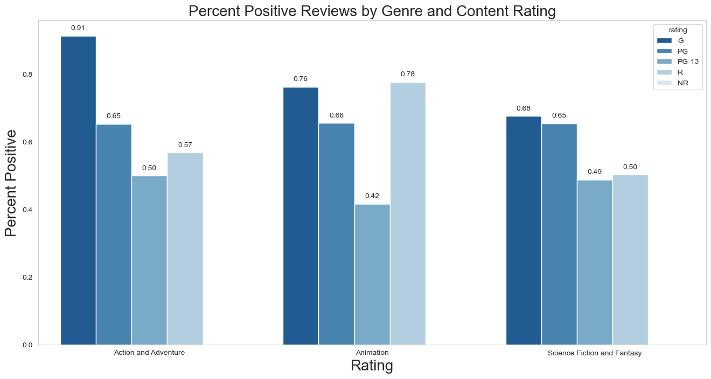

# Microsoft Motion Pictures


> This repository contains our exploratory analysis on files obtained from several movie databases. Our objective in this study is to make actionable recommendations for Microsoft who (hypothetically) wants to enter the movie making industry. In this document, we outline our methodology, our assumptions, and the models constructed which led us to our final conclusions and recommendations.

## Table of Contents
* [Overview](#overview)
* [Business Problem](#business-problem)
* [Data](#data-sources-and-understanding)
* [Analysis](#analysis)
* [Programming Language and Other Tools](#programming-language-and-other-tools)
* [Features](#features)
* [Project Structure](#project-structure)

## Repository Links
* [Tools package](/tools)

## Overview
This project analyzes the best type of films to develop for the client. The analyses of film data from various sources (IMDb, Rotten Tomatoes, etc.) suggest that certain film types are recieved better by the general population. The client can use this analysis to select the best genres, directors, and film rating to improve the sucess of a new movie.

## Business Problem
The client is seeking to establish a movie production studio and wants to develop original video content. In order for the client to successfully compete with its competitors, the client has tasked our team with determining three recommendations on what type of films they should create.

## Data Sources and Understanding

Schemas of the data analyzed


Above we have a relational schema for our datasets. The IMDb schemas were connected by "tconst" and "nconst" keys. For the other tables we resorted to title matching. In order to avoid naming conflicts, we decided to create a new index which removed all white space and non-alphanumeric characters.


## Analysis
Two seperate analysis was done to confirm which genres were the best. The first analysis compared the IMDb database with the BOM database to see which genres were the most popular based upon the number of of votes. This rests upon the assumption that all movie-goers are equally likely to leave a review, regardless of whether their sentiment is negative or positive regarding the movie.
  
  

With that in mind, the IMDb data were merged and initially analyzed for the popularity and the BOM database was added later to provides the overall gross for each film genre. Just from these two database, we found that certain genres were far more popular than others and managed to pull in more revenue.

To validate this result and to incorporate the production budget, a seperate analysis of the IMDb database was compared to the TN database. This data came to a similar conclusion where the most popular were Action, Adventure, Sci-fi, Fantasy, and Animation. As a group we determined that Animation is not a standalone genre and suggest the other 4 as the focus which can be seen in the figure below.



One thing to note here is that while the Musical genre is shown having one of the highest returns, there were very few points of the data that had this information so we decided it would not be a good recommendation, however due to the high return it cannot simply be ignored.

With a clear set of genres in mind, we decided that the backbone to any good movie is having a good director leading the charge. If we assume that a popular movie will be able to make the best return, we can find the most popular movie and figure out who the best directors are.


  
In the figure ablove, the top movies are Advengers: Endgame , Mad Max: Fury Road, and Deadpool where the directors are the Russo Brothers, George Miller, Tim Miller respectively.
    
Wth a good diretor supporting the movie production, we also needed to determine our target audience. Taking a look at the Rotten Tomatoes database and our primary genres of focus, we see that nearly all the primary categories have a good rating among the General audience (G). Moreover, G-rated films are suitable for a wider audience, which intuitively might correspond to a broader appeal in the market.




## Programming Language and other tools
- Python 
- Jupyter notebook, Pycharm
- draw.io

## Features
- Top movie geres based on user ratings
- Top movie geres based on domestic and foreign gross
- Top directors based on movie genres
- Show the most profitable genres
- Show the best motion picture content rating for each of the recommended genres
- module set up for quick and clean processing through code

## Team
- Mia Fryer <br>
    Github: miazfryer<br>
- Ian Sharff <br>
    Github: iansharff<br>
- Arthur Kim <br>
    Github: arthurk2323<br>
- Eddie Lin <br>
    Github: RedDragonfruit<br>

## Project Structure
```
├── README.md
├── __init__.py
├── data      <-- CSV and TSV files used in analyses
├── images      <-- Externally obtained and internally generated images
├── individuals     <--- Directory for individual workspaces
│   ├── arthur
│   ├── eddie
│   ├── ian
│   └── mia
├── microsoft_motion_pictures.ipynb     <-- Jupyter Notebook illustrating analysis
├── microsof_motion_pictures_slides.pdf   <-- Presentation slides
└── tools     <-- Module containing cleaning, merging, parsing, and support functions
    ├── TN_File_Eddie.py  <-- Contains function definition for IMDB + TN analysis
    ├── __init__.py
    ├── data_preparation.py   <-- Contains bulk of data_preparation functions
    └── tools_demo.ipynb      <-- Illustrative Jupyter Notebook showcasing module use
```
